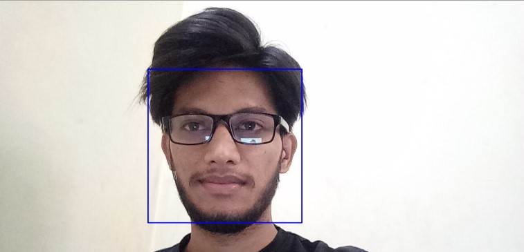

# SENTATE BIEN SALAME

 Me estaba costando mucho mantener una **postura correcta** mientras estaba sentado en la pc 🪑. Y Se me ocurrió darle una solución graciosa a este problema 😊

**Sentate bien salame** Es un programa que te puede ayudar a llegar los 40 con una columna/cervical relativamente sana 🦴

---

## Instrucciones: ⚙️
- Conecta tu webcam o asegúrate de que esté funcionando 📷
- Asegúrate de tener una buena iluminación, aunque lo probé y también funciona bien en bajas condiciones de luz. 🔦
- Clónate el repo.📔
- Vas a necesitar instalarte 2 bibliotecas: `pip install win11toast` , `pip install opencv-python`
- Ingresa al directorio donde guardaste el repo y escribi python `sentate_bien_salame.py`.📂
- Si se te notifica de tu mala postura, vas a tener que arreglarla para poder continuar. 🚫
- Si quieres chusmear o modificar el código a tu gusto, lo puedes hacer. 💻

---

### PREVIEW DEL PROYETO 👀 ##
  

**Pd: NO SOY YO EL DE LA FOTO LA SAQUE DE MEDIUM**

> Espero les guste❗️